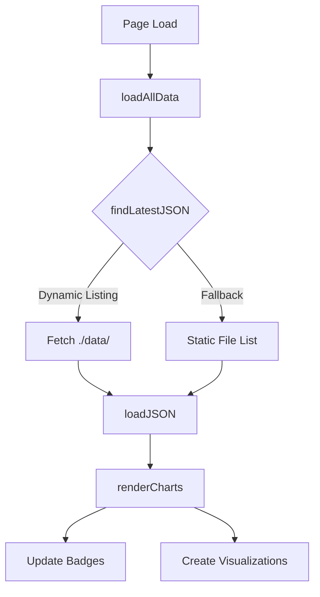

# 📊 Dashboard Qualité - Documentation Complète

> **Documentation technique exhaustive du Dashboard Qualité Interactif StockHub V2**

---

## 📑 Table des Matières

1. [Vue d'ensemble](#vue-densemble)
2. [Accès Rapide](#accès-rapide)
3. [Architecture](#architecture)
4. [Sections du Dashboard](#sections-du-dashboard)
5. [Système de Badges](#système-de-badges)
6. [Visualisations](#visualisations)
7. [Navigation par Onglets](#navigation-par-onglets)
8. [Chargement des Données](#chargement-des-données)
9. [Fonctions JavaScript](#fonctions-javascript)
10. [Optimisations](#optimisations-performances)
11. [Guide d'utilisation](#guide-dutilisation)
12. [Maintenance](#maintenance)
13. [Historique](#historique)

---

## Vue d'ensemble

### Objectif

Le **Dashboard Qualité** (`documentation/metrics/index.html`) est un tableau de bord interactif unique qui agrège et visualise toutes les métriques de qualité du projet StockHub V2 :

- 🔦 **Performance** (Lighthouse)
- ♿ **Accessibilité** (WCAG, Daltonisme, Reduced Motion)
- ⚡ **Performance d'animations** (FPS)
- 📊 **Scalabilité** (Datasets)
- 📈 **Qualité du code** (Coverage)
- 📚 **Audit global** (RNCP)

### Technologies

- **HTML5** : Structure sémantique
- **TailwindCSS 3.x** : Styling via CDN
- **Chart.js** : Graphiques (donut, bar)
- **JavaScript Vanilla** : Logique et interactions
- **JSON** : Format des données métriques

### Caractéristiques

✅ **8 sections** avec visualisations interactives
✅ **8 badges de statut** colorés (vert/jaune/rouge)
✅ **10 onglets** de navigation (WCAG + Daltonisme)
✅ **Chargement automatique** des dernières données
✅ **Lazy loading** pour optimiser les performances
✅ **Responsive** design (mobile/desktop)
✅ **Accessible** en local et GitHub Pages

---

## Accès Rapide

### URLs

- **Local** : http://localhost:5173/documentation/metrics/
- **GitHub Pages** : https://sandrinecipolla.github.io/stockHub_V2_front/documentation/metrics/

### Commandes

```bash
# Lancer le serveur de développement
npm run dev

# Générer toutes les métriques
npm run audit:full

# Servir le dashboard localement
node scripts/serve-metrics.mjs
```

### Fichier Principal

`documentation/metrics/index.html` (2152 lignes)

---

## Architecture

### Structure des fichiers

```
documentation/
├── metrics/
│   ├── index.html                    # Dashboard principal (2152 lignes)
│   ├── data/                         # Données JSON des audits
│   │   ├── lighthouse-*.json
│   │   ├── risk-levels-audit-*.json
│   │   ├── daltonisme-*.json
│   │   ├── fps-*.json
│   │   ├── a11y-*.json
│   │   ├── datasets-*.json
│   │   └── audit-complet-*.json
│   └── coverage/                      # Données de couverture
│       └── coverage-final.json
├── 9-DASHBOARD-QUALITY.md            # Cette documentation
└── sessions/
    ├── 2025-11-20-22-DASHBOARD-INTERACTIF.md
    └── 2025-11-24-DASHBOARD-BADGES.md
```

### Structure HTML

```html
<!DOCTYPE html>
<html class="dark" lang="fr">
  <head>
    <!-- Meta, titre -->
    <script src="https://cdn.tailwindcss.com"></script>
    <script src="https://cdn.jsdelivr.net/npm/chart.js"></script>
    <style>
      /* Variables CSS custom */
      /* Classes pour cartes, badges, animations */
      /* Styles cercles de score Lighthouse */
      /* Styles onglets (WCAG, Daltonisme) */
    </style>
  </head>
  <body class="bg-[var(--sh-dark-bg)] text-white">
    <!-- Header avec date et lien contextuel -->

    <main class="container mx-auto p-6">
      <!-- Grid principal 2 colonnes -->
      <div class="grid md:grid-cols-2 gap-6">
        <!-- Section Lighthouse -->
        <!-- Section WCAG Risk Levels -->
        <!-- Section Daltonisme -->
        <!-- Section Performance FPS -->
        <!-- Section Reduced Motion -->
        <!-- Section Datasets -->
      </div>

      <!-- Sections pleine largeur -->
      <section><!-- Coverage --></section>
      <section><!-- Audit RNCP --></section>
    </main>

    <footer></footer>

    <script>
      /* JavaScript pour chargement et rendu */
    </script>
  </body>
</html>
```

### Variables CSS

```css
:root {
  --sh-purple-500: #8b5cf6;
  --sh-purple-400: #a78bfa;
  --sh-purple-300: #c4b5fd;
  --sh-dark-bg: #1a1a3e;
  --sh-card-bg: #0f0f23;
  --sh-border: rgba(255, 255, 255, 0.15);
}
```

---

## Sections du Dashboard

### 1. 🔦 Lighthouse

**Ligne** : 328-340

**Visualisation** : Cercles de score SVG animés

**Contenu** :

- Score global (grand cercle central)
- Note alphabétique (A/B/C/D/F)
- 4 scores individuels (petits cercles) :
  - Performance
  - Accessibility
  - SEO
  - Best Practices
- Métriques Web Vitals (FCP, LCP, TBT, CLS)

**Badge** : Moyenne des 4 scores

- ✅ **≥ 90** : Excellent (vert)
- ⚠️ **≥ 70** : Bon (jaune)
- ❌ **< 70** : À améliorer (rouge)

**Source** : `lighthouse-*.json`

**Fonction** : `renderCharts()` ligne 750-967

---

### 2. ⚠️ WCAG Risk Levels

**Ligne** : 341-420

**Visualisation** : Graphique en barres (Chart.js) + 6 onglets

**Onglets** :

1. **📊 Vue d'ensemble** : Graphique des problèmes par niveau
2. **🔴 Critique** : Liste détaillée (ratio < 2.5:1)
3. **🟠 Élevé** : Problèmes niveau élevé (ratio 2.5-3.5:1)
4. **🟡 Moyen** : Problèmes niveau moyen (ratio 3.5-4.0:1)
5. **🟢 Faible** : Problèmes niveau faible (ratio 4.0-4.5:1)
6. **🔧 Solutions** : Outils et ressources WCAG

**Classification des problèmes** :

```javascript
const gap = 4.5 - ratio;
if (gap >= 2.0)
  problemLevel = 'critical'; // Très loin
else if (gap >= 1.0)
  problemLevel = 'high'; // Assez loin
else if (gap >= 0.5)
  problemLevel = 'medium'; // Proche
else problemLevel = 'low'; // Très proche
```

**Badge** : Nombre de problèmes critiques

- ✅ **0** : Conforme (vert)
- ❌ **> 0** : X Critique(s) (rouge)

**Source** : `risk-levels-audit-*.json`

**Fonction** : `renderCharts()` ligne 969-1235

---

### 3. 👁 Tests de Daltonisme & Accessibilité Visuelle

**Ligne** : 421-546

**Visualisation** : Graphique donut (Chart.js) + 4 onglets

**Onglets** :

1. **📊 Vue d'ensemble**
   - Graphique donut (tests réussis/échoués)
   - Métriques clés (% contraste, % différentiabilité)
   - Aperçu couleurs de statut StockHub

2. **🎨 Contraste WCAG**
   - Grille de tous les tests de contraste
   - Pour chaque test : status, mode, ratio, level WCAG

3. **👁 Simulation**
   - 4 types de daltonisme testés :
     - Protanopie (~1% hommes)
     - Deutéranopie (~1% hommes)
     - Tritanopie (~0.01%)
     - Achromatopsie (rare)
   - % différentiabilité par type
   - Aperçu couleurs simulées

4. **🔍 Différentiabilité**
   - Analyse Delta E (différence colorimétrique)
   - Seuil : ≥40 pour différentiation correcte

**Badge** : Global tests passés/échoués

- ✅ **Majorité passée** : Conforme (vert)
- ⚠️ **Sinon** : À améliorer (jaune)

**Source** : `daltonisme-*.json`

**Fonction** : `renderCharts()` ligne 1237-1665

---

### 4. ⚡ Performance FPS

**Ligne** : 547-558

**Visualisation** : Cercle SVG + Grille de statistiques

**Contenu** :

- Cercle de progression FPS
- Nombre moyen de FPS
- Statut (fluide/à optimiser)
- Grille 3 colonnes : Tests passés, Tests échoués, Cible (60 FPS)

**Badge** : FPS moyen + allPassed

- ✅ **allPassed** : XX FPS (vert)
- ⚠️ **Sinon** : XX FPS (rouge)

**Source** : `fps-*.json`

**Fonction** : `renderCharts()` ligne 1667-1741

---

### 5. ♿ Accessibilité — Reduced Motion

**Ligne** : 560-571

**Visualisation** : Badge circulaire + Statut détaillé

**Test** : Vérifie si les animations respectent `prefers-reduced-motion`

**CSS testé** :

```css
@media (prefers-reduced-motion: reduce) {
  * {
    animation-duration: 0.01ms !important;
    animation-iteration-count: 1 !important;
    transition-duration: 0.01ms !important;
  }
}
```

**Badge** : Boolean passed

- ✅ **true** : Conforme (vert)
- ❌ **false** : Non conforme (rouge)

**Source** : `a11y-*.json`

**Fonction** : `renderCharts()` ligne 1743-1800

---

### 6. 📊 Scalabilité — Datasets

**Ligne** : 573-584

**Visualisation** : Gauge circulaire SVG + Grille de seuils

**Tests** : Performance avec différentes tailles

- Petit : 5-10 stocks
- Moyen : 50 stocks
- Grand : 200 stocks
- Très grand : 500+ stocks

**Métrique calculée** : Dégradation de performance

```javascript
degradation = ((temps_grand - temps_petit) / temps_petit) * 100;
```

**Badge** : Dégradation ou FPS (fallback)

- ✅ **< 5%** : Excellent (vert)
- ⚠️ **5-15%** : Acceptable (jaune)
- ❌ **> 15%** : Critique (rouge)

**Source** : `datasets-*.json`

**Fonction** : `renderCharts()` ligne 1802-1900

---

### 7. 📈 Coverage des tests

**Ligne** : 587-601

**Visualisation** : Barres de progression + Listes

**Contenu** :

- Couverture globale (instructions)
- Barres par domaine fonctionnel :
  - Dashboard, Analytics, Components UI, Hooks, Utils, Contexts, Data Layer
- Barres par fonctionnalité utilisateur :
  - Gestion Stocks (CRUD), Prédictions IA, Alertes & Statuts, etc.
- Top 5 meilleurs fichiers
- Top 5 priorités (faible couverture)

**Badge** : % instructions

- ✅ **≥ 85%** : Bon (vert)
- ⚠️ **70-84%** : Moyen (jaune)
- ❌ **< 70%** : Faible (rouge)

**Source** : `coverage/coverage-final.json`

**Fonction** : `loadCoverage()` ligne 1967-2145

---

### 8. 📚 Audit Complet RNCP — Synthèse

**Ligne** : 603-641

**Visualisation** : Résumé + Détails accordéon (lazy-loaded)

**Contenu initial** :

- Timestamp de génération
- Lien de téléchargement JSON
- Bouton "📂 Voir / Masquer les détails"

**Sections détaillées** (lazy-loaded) :

1. **📊 Performance** : Lighthouse Performance, FPS, Dégradation datasets
2. **♿ Accessibilité** : Lighthouse Accessibility, Reduced Motion, Daltonisme, WCAG
3. **🌱 Éco-conception** : Indicateurs principaux
4. **💎 Qualité du code** : Coverage (statements, functions, branches)

**Badge** : Score global (moyenne 4 métriques)

Calcul :

```javascript
score = (lighthouse_performance + lighthouse_accessibility + fps_score + coverage) / 4;
```

Conversion FPS :

- `allPassed = true` → 100 points
- `allPassed = false` → 50 points

**Seuils** :

- ✅ **≥ 85%** : Excellent (vert)
- ⚠️ **70-84%** : Bon (jaune)
- ❌ **< 70%** : À améliorer (rouge)

**Lazy Loading** : Badge mis à jour seulement après ouverture des détails

**Source** : `audit-complet-*.json`

**Fonction** : `renderAudit()` ligne 1903-1965

---

## Système de Badges

### Architecture

Chaque section affiche un badge de statut dans son titre :

```html
<h2 class="section-title flex items-center gap-3">
  🔦 Lighthouse
  <div
    class="text-xs px-3 py-1 rounded-full bg-gray-700 text-gray-300"
    id="lighthouse-status-badge"
  >
    ⏳ Chargement...
  </div>
</h2>
```

### États d'un badge

1. **Chargement** (initial)

   ```css
   bg-gray-700 text-gray-300
   ```

   Texte : "⏳ Chargement..."

2. **Succès** (vert)

   ```css
   bg-green-500/20 text-green-400
   ```

   Texte : "✅ Excellent" / "✅ Conforme" / "✅ XX%"

3. **Avertissement** (jaune)

   ```css
   bg-yellow-500/20 text-yellow-400
   ```

   Texte : "⚠️ Bon" / "⚠️ XX%"

4. **Erreur** (rouge)
   ```css
   bg-red-500/20 text-red-400
   ```
   Texte : "❌ À améliorer" / "❌ Non conforme" / "❌ XX%"

### Tableau Récapitulatif

| Section        | Badge ID                  | Calcul               | Seuils                          |
| -------------- | ------------------------- | -------------------- | ------------------------------- |
| Lighthouse     | `lighthouse-status-badge` | Moyenne 4 scores     | ≥90: ✅ / ≥70: ⚠️ / <70: ❌     |
| WCAG Risk      | `wcag-status-badge`       | Compte critiques     | 0: ✅ / >0: ❌ X                |
| Daltonisme     | `daltonisme-status-badge` | Tests passés/échoués | Majorité: ✅ / Sinon: ⚠️        |
| FPS            | `fps-status-badge`        | Moyenne + allPassed  | allPassed: ✅ XX / Sinon: ⚠️ XX |
| Reduced Motion | `a11y-status-badge`       | Boolean passed       | true: ✅ / false: ❌            |
| Datasets       | `datasets-status-badge`   | Dégradation ou FPS   | <5%: ✅ / 5-15%: ⚠️ / >15%: ❌  |
| Coverage       | `coverage-status-badge`   | % instructions       | ≥85%: ✅ / ≥70%: ⚠️ / <70%: ❌  |
| Audit RNCP     | `audit-rncp-status-badge` | Moyenne 4 métriques  | ≥85%: ✅ / ≥70%: ⚠️ / <70%: ❌  |

### Mise à jour dynamique

Les badges sont mis à jour après le chargement des données :

```javascript
const badge = document.getElementById('lighthouse-status-badge');
if (badge) {
  const hasExcellent = avgScore >= 90;

  badge.className = `text-xs px-3 py-1 rounded-full ${
    hasExcellent ? 'bg-green-500/20 text-green-400' : 'bg-red-500/20 text-red-400'
  }`;

  badge.textContent = hasExcellent ? '✅ Excellent' : '❌ À améliorer';
}
```

---

## Visualisations

### 1. Cercles de score (Lighthouse, FPS)

**Technologie** : SVG natif + CSS

**Principe** : `stroke-dasharray` pour animations circulaires

**Code** :

```javascript
// Circonférence du cercle
const circumference = 2 * Math.PI * rayon;

// Arc à afficher selon le score
const arc = (score / 100) * circumference;

// Application
circle.style.strokeDasharray = `${arc} ${circumference}`;
circle.style.transition = 'stroke-dasharray 1.5s ease-in-out';
```

**HTML** :

```html
<svg class="w-16 h-16 transform -rotate-90" viewBox="0 0 84 84">
  <!-- Cercle de fond -->
  <circle cx="42" cy="42" r="40" stroke="rgba(255,255,255,0.1)" stroke-width="4" fill="none" />

  <!-- Cercle de progression -->
  <circle
    cx="42"
    cy="42"
    r="40"
    stroke="#10b981"
    stroke-width="4"
    fill="none"
    stroke-linecap="round"
    stroke-dasharray="251 251"
    class="transition-all duration-1000"
  />
</svg>
```

**Tailles** :

- Large : 140px (score global)
- Normal : 100px (scores individuels)

---

### 2. Graphique en barres (WCAG Risk Levels)

**Technologie** : Chart.js

**Configuration** :

```javascript
new Chart(ctx, {
  type: 'bar',
  data: {
    labels: ['🔴 Critique', '🟠 Élevé', '🟡 Moyen', '🟢 Faible'],
    datasets: [
      {
        data: [critiques, eleves, moyens, faibles],
        backgroundColor: ['#ef4444', '#f97316', '#facc15', '#4ade80'],
        borderRadius: 4,
      },
    ],
  },
  options: {
    responsive: true,
    plugins: {
      legend: { display: false },
      tooltip: {
        callbacks: {
          label: context => {
            const pct = ((context.parsed.y / total) * 100).toFixed(1);
            return `${context.parsed.y} problèmes (${pct}%)`;
          },
        },
      },
    },
  },
});
```

---

### 3. Graphique donut (Daltonisme)

**Technologie** : Chart.js

**Configuration** :

```javascript
new Chart(ctx, {
  type: 'doughnut',
  data: {
    labels: ['Tests réussis', 'Tests échoués'],
    datasets: [
      {
        data: [passed, failed],
        backgroundColor: ['#10b981', '#ef4444'],
        borderWidth: 0,
      },
    ],
  },
  options: {
    cutout: '60%', // Taille du trou central
    plugins: { legend: { display: false } },
  },
});
```

**Overlay central** :

```html
<div class="chart-overlay">
  <div class="text-2xl font-bold">85%</div>
  <div class="text-xs">Conformité</div>
</div>
```

---

### 4. Barres de progression (Coverage)

**Technologie** : HTML/CSS pur

**Code** :

```javascript
const bar = percentage => `
    <div class='h-2 w-full bg-white/10 rounded'>
        <div class='h-2 rounded bg-[var(--sh-purple-500)]'
             style='width:${percentage.toFixed(1)}%'></div>
    </div>
`;
```

**Couleurs dynamiques** :

```javascript
const colorFor = pct =>
  pct >= 85 ? 'text-green-400' : pct >= 70 ? 'text-yellow-400' : 'text-red-400';
```

---

## Navigation par Onglets

### Sections avec onglets

1. **WCAG Risk Levels** (6 onglets)
2. **Daltonisme** (4 onglets)

### Architecture

#### HTML

```html
<!-- Barre d'onglets -->
<div class="flex gap-1 bg-gray-800/50 p-1 rounded-lg">
  <button class="wcag-tab active" data-tab="overview">📊 Vue d'ensemble</button>
  <button class="wcag-tab" data-tab="critical">🔴 Critique</button>
  <!-- ... autres onglets -->
</div>

<!-- Panneaux de contenu -->
<div id="wcag-content">
  <div class="wcag-panel active" data-panel="overview">
    <!-- Contenu vue d'ensemble -->
  </div>
  <div class="wcag-panel" data-panel="critical">
    <!-- Contenu critique -->
  </div>
  <!-- ... -->
</div>
```

#### CSS

```css
.wcag-tab {
  background-color: transparent;
  color: #9ca3af;
  transition: all 0.2s;
}

.wcag-tab.active {
  background-color: var(--sh-purple-500);
  color: white;
}

.wcag-panel {
  display: none;
}

.wcag-panel.active {
  display: block;
}
```

#### JavaScript

```javascript
function initWcagTabs() {
  const tabs = document.querySelectorAll('.wcag-tab');
  const panels = document.querySelectorAll('.wcag-panel');

  tabs.forEach(tab => {
    tab.addEventListener('click', () => {
      const targetPanel = tab.dataset.tab;

      // Désactiver tous
      tabs.forEach(t => t.classList.remove('active'));
      panels.forEach(p => p.classList.remove('active'));

      // Activer sélection
      tab.classList.add('active');
      const panel = document.querySelector(`[data-panel="${targetPanel}"]`);
      if (panel) panel.classList.add('active');
    });
  });
}
```

---

## Chargement des Données

### Architecture



### Fonction findLatestJSON

**Objectif** : Trouver automatiquement le fichier JSON le plus récent

**Stratégie double** :

```javascript
async function findLatestJSON(prefix) {
  // Liste statique (fallback pour GitHub Pages)
  const staticFileList = [
    'lighthouse-1763634146672.json',
    'risk-levels-audit-1763634259430.json',
    'daltonisme-1763648733792.json',
    'fps-1763634225042.json',
    'a11y-1763635763804.json',
    'datasets-1763634247354.json',
    'audit-complet-1763634146592.json',
  ];

  // Mapping préfixe → pattern
  const prefixMapping = {
    lighthouse: /^lighthouse-\d+\.json$/,
    'risk-levels': /^risk-levels-audit-\d+\.json$/,
    daltonisme: /^daltonisme-\d+\.json$/,
    fps: /^fps-\d+\.json$/,
    a11y: /^a11y-\d+\.json$/,
    datasets: /^datasets-\d+\.json$/,
    'audit-complet': /^audit-complet-\d+\.json$/,
  };

  const pattern = prefixMapping[prefix];

  try {
    // Tenter listage dynamique
    const resp = await fetch('./data/');
    if (resp.ok) {
      const text = await resp.text();
      const matches = [...text.matchAll(/href="([^"]+\.json)"/g)]
        .map(m => m[1])
        .filter(name => pattern.test(name));
      if (matches.length > 0) {
        matches.sort().reverse(); // Plus récent en premier
        return './data/' + matches[0];
      }
    }
  } catch (e) {
    console.log(`Erreur listage dynamique pour ${prefix}:`, e);
  }

  // Fallback : liste statique
  const staticMatches = staticFileList.filter(name => pattern.test(name));
  if (staticMatches.length > 0) {
    staticMatches.sort().reverse();
    return './data/' + staticMatches[0];
  }

  return null;
}
```

### Timestamps

Format : `{type}-{timestamp}.json`

Exemple : `lighthouse-1763634146672.json`

- Type : `lighthouse`
- Timestamp : `1763634146672` (millisecondes Unix)

**Tri** : Les timestamps permettent un tri automatique pour récupérer le plus récent

---

## Fonctions JavaScript

### Fonctions principales

| Fonction                 | Ligne     | Rôle                                   |
| ------------------------ | --------- | -------------------------------------- |
| `findLatestJSON(prefix)` | 654-714   | Trouve le JSON le plus récent          |
| `loadJSON(prefix)`       | 716-721   | Charge un JSON                         |
| `loadAllData()`          | 723-736   | Charge toutes les données principales  |
| `toggleAuditDetails()`   | 740-748   | Bascule affichage audit + lazy load    |
| `renderCharts(data)`     | 750-1890  | Rendu principal de toutes les sections |
| `renderAudit(audit)`     | 1903-1965 | Rendu section Audit RNCP               |
| `loadCoverage()`         | 1967-2145 | Charge et affiche la couverture        |

### Fonctions spécialisées

**WCAG** :

- `initWcagTabs()` : Initialise les onglets
- `populateWcagProblems()` : Remplit les onglets de problèmes

**Daltonisme** :

- `initDaltonismeTabs()` : Initialise les onglets
- `populateStatusColors()` : Affiche les couleurs StockHub
- `populateContrastTests()` : Grille des tests de contraste
- `populateSimulations()` : Cartes de simulation daltonisme
- `populateDifferenceAnalysis()` : Analyse Delta E
- `updateMainMetrics()` : Mise à jour des métriques principales

### Utilitaires

```javascript
// Couleur selon pourcentage
const colorFor = pct =>
  pct >= 85 ? 'text-green-400' : pct >= 70 ? 'text-yellow-400' : 'text-red-400';

// Couleur selon score Lighthouse
const getScoreColor = score => {
  if (score >= 90) return '#10b981'; // green
  if (score >= 70) return '#f59e0b'; // amber
  return '#ef4444'; // red
};

// Calcul pourcentage
const pct = (covered, total) => (total === 0 ? 0 : (covered / total) * 100);

// Barre de progression
const bar = percentage => `
    <div class='h-2 w-full bg-white/10 rounded'>
        <div class='h-2 rounded bg-[var(--sh-purple-500)]'
             style='width:${percentage.toFixed(1)}%'></div>
    </div>
`;
```

---

## Optimisations Performances

### 1. Lazy Loading (Audit RNCP)

**Problème** : Fichier audit-complet fait ~15KB et n'est pas toujours consulté

**Solution** : Chargement à la demande

```javascript
let auditLoaded = false;
async function toggleAuditDetails() {
  const details = document.getElementById('audit-details');
  details.classList.toggle('hidden');

  if (!auditLoaded && !details.classList.contains('hidden')) {
    const audit = await loadJSON('audit-complet');
    renderAudit(audit);
    auditLoaded = true;
  }
}
```

**Gain** : ~15KB + parsing JSON + rendu HTML économisés au chargement initial

---

### 2. Délais d'animation

```javascript
setTimeout(() => {
  const progressRings = container.querySelectorAll('.score-circle-progress');
  progressRings.forEach(ring => {
    const strokeDashArray = (score / 100) * circumference;
    ring.style.strokeDasharray = `${strokeDashArray} ${circumference}`;
  });
}, 200);
```

**Raison** : Permet au DOM de se construire avant les animations

---

### 3. CDN pour bibliothèques

```html
<script src="https://cdn.tailwindcss.com"></script>
<script src="https://cdn.jsdelivr.net/npm/chart.js"></script>
```

**Avantage** : Mise en cache par le navigateur entre sites

---

### 4. Fallback liste statique

La liste statique évite les erreurs réseau en production (GitHub Pages)

---

## Guide d'utilisation

### Développement local

#### 1. Lancer le serveur

```bash
npm run dev
```

Accéder à : http://localhost:5173/documentation/metrics/

#### 2. Générer de nouvelles métriques

```bash
# Lighthouse
npm run audit:lighthouse

# FPS
npm run audit:fps

# Datasets
npm run audit:datasets

# Accessibilité
npm run audit:a11y
npm run audit:risk-levels
npm run audit:daltonisme

# Coverage
npm run test:coverage

# Audit complet
npm run audit:full
```

#### 3. Vérifier les fichiers générés

```bash
ls -la documentation/metrics/data/
```

Format attendu : `{type}-{timestamp}.json`

#### 4. Recharger le dashboard

Le dashboard détecte automatiquement les nouveaux fichiers (timestamp le plus récent)

Rafraîchir : **Ctrl+R** ou **F5**

---

### Déploiement

#### GitHub Pages

Automatique via GitHub Actions

URL : https://sandrinecipolla.github.io/stockHub_V2_front/documentation/metrics/

#### Mise à jour liste statique

Après génération de nouvelles métriques :

1. Éditer `index.html` ligne 659
2. Mettre à jour `staticFileList`
3. Ajouter les nouveaux fichiers

```javascript
const staticFileList = [
  'lighthouse-1763634146672.json', // Ancien
  'lighthouse-1763700000000.json', // Nouveau
  // ...
];
```

---

### Troubleshooting

#### Badge reste "⏳ Chargement..."

**Causes** :

- Aucun fichier JSON dans `data/`
- Nom de fichier incorrect
- Erreur de parsing JSON

**Solution** :

1. Vérifier présence fichiers : `ls documentation/metrics/data/`
2. Console navigateur (F12) → erreurs
3. Tester JSON manuellement

#### Graphiques Chart.js absents

**Causes** :

- Chart.js pas chargé (CDN bloqué)
- Données null/undefined

**Solution** :

1. Console → vérifier Chart.js chargé
2. Vérifier données existent

#### Onglets ne fonctionnent pas

**Causes** :

- JavaScript non initialisé
- Erreur bloquant l'exécution

**Solution** :

1. Vérifier appel `initWcagTabs()` ou `initDaltonismeTabs()`
2. Console → erreurs JavaScript
3. Vérifier correspondance `data-tab` / `data-panel`

---

## Maintenance

### Ajouter une section

#### 1. HTML

```html
<section class="card metric-card fade-in">
  <h2 class="section-title flex items-center gap-3">
    🆕 Nouvelle Section
    <div class="text-xs px-3 py-1 rounded-full bg-gray-700 text-gray-300" id="new-section-badge">
      ⏳ Chargement...
    </div>
  </h2>
  <div id="new-section-result"></div>
</section>
```

#### 2. Chargement

```javascript
// Dans loadAllData()
const newData = await loadJSON('new-data-type');
renderCharts({ ..., newData });
```

#### 3. Mapping

```javascript
// Dans findLatestJSON()
const prefixMapping = {
  'new-data-type': /^new-data-type-\d+\.json$/,
};
```

#### 4. Rendu

```javascript
// Dans renderCharts()
if (newData) {
  // Afficher section
  // Mettre à jour badge
}
```

---

### Modifier les seuils

**Rechercher** :

```javascript
const hasExcellent = avgScore >= 90;
```

**Remplacer** :

```javascript
const hasExcellent = avgScore >= 85;
```

---

## Historique

### Sessions de développement

| Date               | Session                                                                | Travail                                |
| ------------------ | ---------------------------------------------------------------------- | -------------------------------------- |
| **20-22 nov 2025** | [Dashboard Interactif](sessions/2025-11-20-22-DASHBOARD-INTERACTIF.md) | Création dashboard (PRs #44, #45, #46) |
| **24 nov 2025**    | [Dashboard Badges](sessions/2025-11-24-DASHBOARD-BADGES.md)            | Ajout 8 badges de statut               |

### Versions

| Version | Date        | Changements                                |
| ------- | ----------- | ------------------------------------------ |
| 1.0.0   | 20 nov 2025 | Dashboard initial (structure + graphiques) |
| 1.1.0   | 21 nov 2025 | Onglets WCAG + Daltonisme                  |
| 1.2.0   | 22 nov 2025 | Optimisations + Coverage + Audit RNCP      |
| 1.3.0   | 24 nov 2025 | 8 badges de statut ajoutés                 |

---

## 📊 Statistiques

### Code

- **Fichier principal** : 2152 lignes
- **HTML** : ~40%
- **CSS** : ~15%
- **JavaScript** : ~45%

### Métriques intégrées

- **8 sources de données** JSON
- **8 badges** de statut
- **10 onglets** de navigation
- **5 types de graphiques** (cercles, barres, donut, gauges, barres progression)

### Performance

- **Temps de chargement initial** : < 1s
- **Lazy loading** : -15KB économisés
- **Bundle** : 0 KB (HTML standalone)

---

## 🔗 Références

### Documentation

- **Index général** : [0-INDEX.md](0-INDEX.md)
- **Sessions** : [7-SESSIONS.md](7-SESSIONS.md)

### Sessions liées

- [2025-11-20-22-DASHBOARD-INTERACTIF.md](sessions/2025-11-20-22-DASHBOARD-INTERACTIF.md)
- [2025-11-24-DASHBOARD-BADGES.md](sessions/2025-11-24-DASHBOARD-BADGES.md)

### Liens externes

- **Lighthouse** : https://developer.chrome.com/docs/lighthouse
- **WCAG 2.1** : https://www.w3.org/WAI/WCAG21/quickref/
- **WebAIM Contrast** : https://webaim.org/resources/contrastchecker/
- **Chart.js** : https://www.chartjs.org/docs/latest/
- **TailwindCSS** : https://tailwindcss.com/docs

---

**Dernière mise à jour** : 24 novembre 2025
**Version** : 1.3.0
**Projet** : StockHub V2 - Frontend
**Auteur** : Sandrine Cipolla
