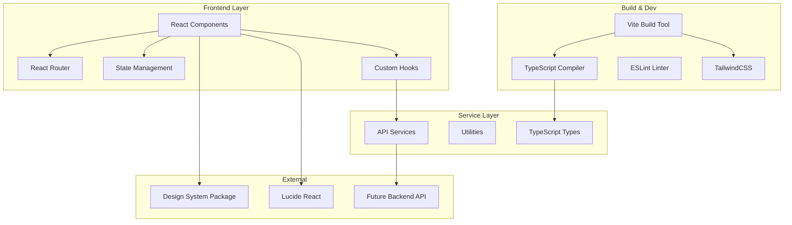
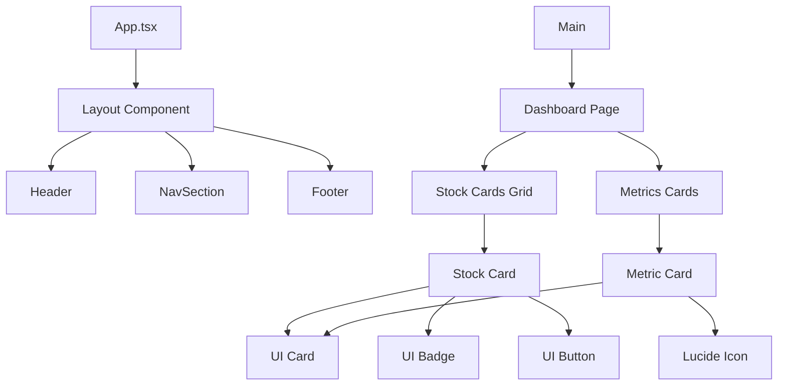
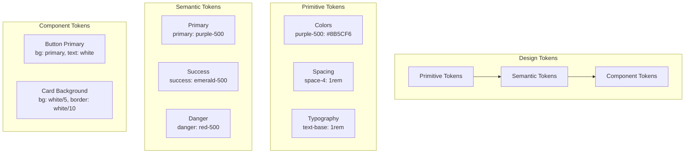
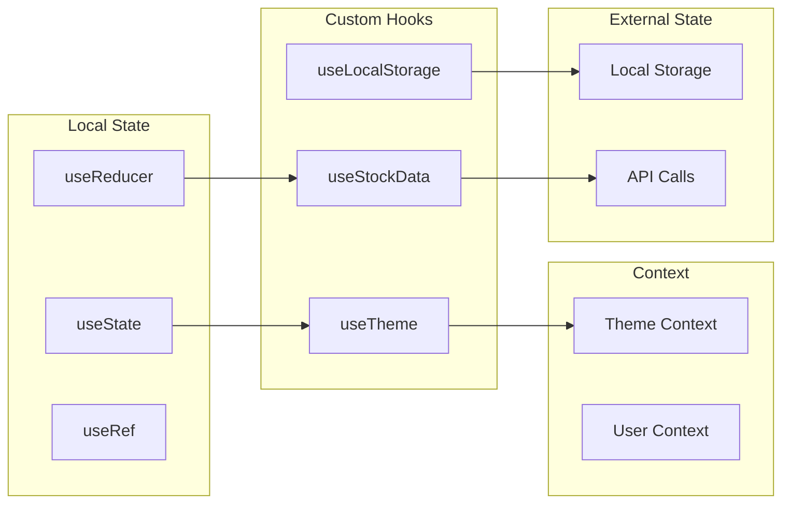
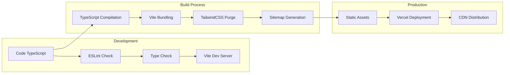

# Architecture Technique - StockHub V2

## 🏗️ Vue d'ensemble de l'architecture

StockHub V2 adopte une architecture moderne basée sur React avec TypeScript, privilégiant la modularité, la maintenabilité et les performances. L'application suit les principes de Clean Architecture et de Separation of Concerns.

## 📊 Schéma d'architecture globale



## 🗂️ Structure détaillée des dossiers

```
src/
├── components/                 # Composants réutilisables
│   ├── common/                    # Composants UI de base
│   │   ├── Button/
│   │   ├── Card/
│   │   ├── Badge/
│   │   └── Input/
│   ├── layout/                # Composants de mise en page
│   │   ├── Header/
│   │   ├── NavSectiion/
│   │   ├── Footer/
│   └── dashboard/              # Composants métier
│       ├── MetricCard/
│       ├── StockGrid/
│       ├── StockCard/
├── hooks/                     # Hooks personnalisés
│   ├── useTheme.ts
│   ├── useFrontendState.ts
│   └── useStock.ts
├── types/                     # Types TypeScript globaux
│   ├── index.ts
├── styles/                    # Styles globaux et tokens
│   ├── globals.css
│   ├── tokens.css
│   └── components.css
├── pages/                     # Pages de l'application
│   ├── Dashboard/
└── utils/                     # Utilitaires globaux
```

## 🔧 Architecture des composants

### Principe de composition



### Pattern de composants adoptés

#### 1. **Atomic Design Pattern**
```typescript
// Atoms (composants de base)
Button, Input, Badge, Icon

// Molecules (combinaisons d'atoms)
SearchBar, MetricCard, StockCardActions

// Organisms (sections complexes)
Header, StockGrid, Dashboard

// Templates (layouts)
Layout, PageTemplate

// Pages (instances complètes)
DashboardPage, StockManagementPage
```

#### 2. **Compound Components Pattern**
```tsx
// Exemple : Card composé
<Card>
    <Card.Header>
        <Card.Title>Stock Item</Card.Title>
        <Card.Badge variant="success">Optimal</Card.Badge>
    </Card.Header>
    <Card.Content>
        <Card.Metrics>
            <Card.Metric label="Quantity" value="156" />
            <Card.Metric label="Value" value="€2,450" />
        </Card.Metrics>
    </Card.Content>
    <Card.Actions>
        <Button variant="ghost">View</Button>
        <Button variant="ghost">Edit</Button>
    </Card.Actions>
</Card>
```

## 🎨 Architecture du Design System

### Token System Hiérarchique



### Système de thèmes

```typescript
// Theme Provider Architecture
interface ThemeContext {
  theme: 'light' | 'dark';
  toggleTheme: () => void;
  tokens: DesignTokens;
}

interface DesignTokens {
  colors: {
    primary: Record<string, string>;
    semantic: Record<string, string>;
    neutral: Record<string, string>;
  };
  spacing: Record<string, string>;
  typography: Record<string, string>;
}
```

## 🔄 Flux de données et état

### Architecture de gestion d'état



### Pattern de hooks personnalisés

```typescript
// Hook de gestion des stocks
const useStockData = () => {
  const [stocks, setStocks] = useState<Stock[]>([]);
  const [loading, setLoading] = useState(false);
  const [error, setError] = useState<string | null>(null);

  const fetchStocks = useCallback(async () => {
    setLoading(true);
    try {
      const data = await stockService.getAll();
      setStocks(data);
    } catch (err) {
      setError(err.message);
    } finally {
      setLoading(false);
    }
  }, []);

  return { stocks, loading, error, fetchStocks };
};
```

## 🚀 Architecture de build et déploiement

### Pipeline de développement



### Configuration de build optimisée

```ts
// vite.config.ts
import { defineConfig } from 'vite'
import react from '@vitejs/plugin-react'
import path from 'path'

export default defineConfig({
    plugins: [react()],
    resolve: {
        alias: {
            '@': path.resolve(__dirname, './src'),
        },
    },
})
```
### Script de génération SEO automatisé

```ts
// scripts/generate-sitemap.ts
interface SitemapRoute {
    loc: string
    lastmod: string
    changefreq: 'always' | 'hourly' | 'daily' | 'weekly' | 'monthly' | 'yearly' | 'never'
    priority: number
}

const baseUrl = 'https://stockhub-v2.vercel.app'

const routes: SitemapRoute[] = [
    { 
        loc: '/', 
        lastmod: new Date().toISOString().split('T')[0],
        changefreq: 'weekly', 
        priority: 1.0 
    },
    { 
        loc: '/dashboard', 
        lastmod: new Date().toISOString().split('T')[0],
        changefreq: 'daily', 
        priority: 0.9 
    },
    { 
        loc: '/stocks', 
        lastmod: new Date().toISOString().split('T')[0],
        changefreq: 'daily', 
        priority: 0.8 
    },
    { 
        loc: '/analytics', 
        lastmod: new Date().toISOString().split('T')[0],
        changefreq: 'weekly', 
        priority: 0.7 
    },
    { 
        loc: '/settings', 
        lastmod: new Date().toISOString().split('T')[0],
        changefreq: 'monthly', 
        priority: 0.5 
    }
]

// Fonctions de génération automatique de sitemap.xml et robots.txt
function generateSitemap(): string {
    return `<?xml version="1.0" encoding="UTF-8"?>
<urlset xmlns="http://www.sitemaps.org/schemas/sitemap/0.9">
${routes.map(route => `  <url>
    <loc>${baseUrl}${route.loc}</loc>
    <lastmod>${route.lastmod}</lastmod>
    <changefreq>${route.changefreq}</changefreq>
    <priority>${route.priority}</priority>
  </url>`).join('\n')}
</urlset>`
}
```
## 🔒 Architecture de sécurité et performance

### SEO et génération automatique

Le projet intègre un système de génération automatique des fichiers SEO :

```
# Process de build avec SEO
npm run build
├── npm run generate-sitemap    # Génère sitemap.xml + robots.txt
├── tsc -b                     # Compilation TypeScript
└── vite build                 # Build Vite optimisé
```

**Fichiers générés automatiquement :**
```
public/
├── sitemap.xml               # Plan du site pour moteurs de recherche
└── robots.txt               # Instructions pour crawlers
```

**Routes configurées dans le sitemap :**
- `/` - Page d'accueil (priorité 1.0, weekly)
- `/dashboard` - Tableau de bord (priorité 0.9, daily)
- `/stocks` - Gestion stocks (priorité 0.8, daily)
- `/analytics` - Analytics (priorité 0.7, weekly)
- `/settings` - Paramètres (priorité 0.5, monthly)

### Sécurité frontend

```typescript
// Validation d'entrées utilisateur
interface InputValidation {
  sanitize: (input: string) => string;
  validate: (input: string, rules: ValidationRule[]) => boolean;
  escape: (input: string) => string;
}

// Configuration CSP (Content Security Policy)
const cspDirectives = {
  'default-src': ["'self'"],
  'script-src': ["'self'", "'unsafe-inline'"],
  'style-src': ["'self'", "'unsafe-inline'"],
  'img-src': ["'self'", "data:", "https:"],
};
```

## 🧪 Architecture de test

### Stratégie de test pyramidale

```mermaid
pyramid
    title Test Strategy
    
    section E2E Tests
        Cypress : 5%
    
    section Integration Tests
        React Testing Library : 15%
    
    section Unit Tests
        Jest + Vitest : 80%
```

### Structure des tests

```typescript

```

## 📱 Architecture responsive et accessibilité

### Mobile First Approach

```scss
// Breakpoints système
$breakpoints: (
  'sm': 640px,   // Mobile large
  'md': 768px,   // Tablet
  'lg': 1024px,  // Desktop
  'xl': 1280px,  // Large desktop
  '2xl': 1536px  // Extra large
);

// Grid responsive
.stock-grid {
  @apply grid grid-cols-1;
  
  @screen md {
    @apply grid-cols-2;
  }
  
  @screen xl {
    @apply grid-cols-3;
  }
}
```

### Standards d'accessibilité RGAA

1. **Structure sémantique** : Headings hiérarchiques, landmarks ARIA
2. **Navigation clavier** : Focus management, tab order
3. **Contrastes** : Ratio 4.5:1 minimum
4. **Lecteurs d'écran** : ARIA labels, descriptions
5. **Animations** : Respect de `prefers-reduced-motion`

## 🔮 Architecture évolutive

### Préparation pour l'évolution

```typescript
// Interface pour l'API future
interface APIClient {
  get<T>(endpoint: string, params?: Record<string, any>): Promise<T>;
  post<T>(endpoint: string, data: any): Promise<T>;
  put<T>(endpoint: string, data: any): Promise<T>;
  delete(endpoint: string): Promise<void>;
}

// Service abstrait pour l'intégration future
abstract class BaseService {
  constructor(protected client: APIClient) {}
  abstract getAll(): Promise<any[]>;
  abstract getById(id: string): Promise<any>;
  abstract create(data: any): Promise<any>;
  abstract update(id: string, data: any): Promise<any>;
  abstract delete(id: string): Promise<void>;
}
```

### Modules préparés pour l'extension

- **Authentification** : Context et hooks prêts
- **Internationalisation** : Structure i18n préparée
- **PWA** : Manifeste et service worker configurables
- **Analytics** : Event tracking abstrait
- **Tests** : Infrastructure de test complète

## 📈 Métriques et monitoring

### Indicateurs de performance

1. **Core Web Vitals** : LCP, FID, CLS
2. **Bundle Size** : Monitoring avec Vite Bundle Analyzer
3. **Lighthouse Score** : Performance, Accessibility, SEO
4. **TypeScript Coverage** : 100% de couverture typée

### Architecture de monitoring

```typescript

```

---

## 🎯 Justifications architecturales

### Choix techniques majeurs

#### 1. **React 19 + TypeScript**
- **Justification** : Écosystème mature, performances optimisées, typage strict
- **Avantages** : Developer Experience, maintenabilité, détection d'erreurs

#### 2. **Vite comme build tool**
- **Justification** : Build ultra-rapide, HMR instantané, configuration minimale
- **Avantages** : Productivité développeur, optimisations automatiques

#### 3. **TailwindCSS**
- **Justification** : Utility-first, design system intégré, purge automatique
- **Avantages** : Cohérence visuelle, performance CSS, développement rapide

#### 4. **Architecture modulaire**
- **Justification** : Séparation des responsabilités, réutilisabilité, testabilité
- **Avantages** : Maintenance facilitée, évolutivité, collaboration en équipe

#### 5. **Design System Package externe**
- **Justification** : Réutilisabilité cross-projets, versioning indépendant
- **Avantages** : Cohérence multi-applications, updates centralisées

Cette architecture garantit une application performante, maintenable et évolutive, alignée sur les standards modernes du développement frontend.